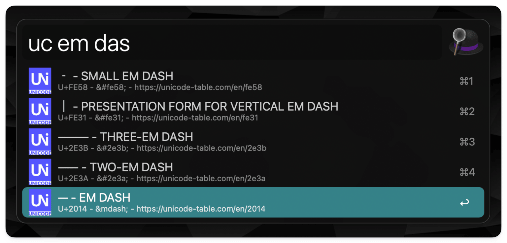

# Unicode Names

Small utility to print **U**ni**c**ode symbol **n**ames. The main reference
is https://www.unicode.org/Public/UCD/latest/ucd/UnicodeData.txt.

## Usage

    $> ucn [FLAGS] [CP...]

Prints Unicode symbols to Stdout. All processing remains local, no external
service is triggered. Any non-flag argument provided is used to filter the
built in code points.

### Flags

    -ofmt.alfred
        use special JSON format ready to be used in http://alfredapp.com
    -ofmt.etab (default)
        use Elastic Tabstops (default)
    -ofmt.json
        use JSON to print the symbols
    -ofmt.tsv
        use tab-separated values

    -limit value
        limit results to <value> symbols

    -filter.fuzzy value
        fuzzy filter all symbol names for <value>
    -filter.partial value
        filter all symbol names for a partial match on <value>
    -filter.starts-with value
        filter all symbol names for the ones which starts-with <value>

    -reverse value
        reverse list of symbols

    -license 
        print license information and exit
    -v 
        print version and exit

The filter flags `-filter.*`, `-limit` and `-reverse` can be given multiple
times: they are applied in the order they are provided. See Examples down below.

The output format flags `-ofmt.*` can be given multiple times: the last one
given wins.

### Output Formats

The `-ofmt.*` flags define the output format for the (filtered) Unicode symbols.

#### Elastic Tabstops

Print (filtered) Unicode symbols as properly aligned text by using the
Elastic Tabstop algorithm, see http://nickgravgaard.com/elastictabstops/index.html
for more information.

The columns are (in order):

* the symbol
* code point number in HEX
* code point in Unicode format (see https://pkg.go.dev/fmt#hdr-Printing)
* HTML entity
* JSON encoded
* the name / description

#### TSV

Print (filtered) Unicode symbols as tab-separated values.

The columns are (in order):

* the symbol
* code point number in HEX
* code point in Unicode format (see https://pkg.go.dev/fmt#hdr-Printing)
* HTML entity
* JSON encoded
* the name / description

#### JSON

Print (filtered) Unicode symbols as JSON.

```json
[
  {
    "name": "MATHEMATICAL BOLD SMALL PI",
    "cp": "U+1D6D1",
    "html": "&#1d6d1;",
    "json": "\\u1d6d1",
    "symbol": "𝛑",
    "www": "https://symbl.cc/en/1d6d1"
  },
  …
]
```

#### AlfredApp

AlfredApp is using the JSON formatted output to interactively render the
results of a search to its UI. See also the #Extras section.

```json
{
    "items": [
      {
        "title": "𝛑 - MATHEMATICAL BOLD SMALL PI",
        "subtitle": "U+1D6D1 - &#1d6d1; - https://symbol.cc/en/1d6d1",
        "arg": "𝛑",
        "variables": {
          "cp": "U+1D6D1",
          "html": "&#1d6d1;",
          "json": "\\u1d6d1",
          "symbol": "𝛑",
          "www": "https://symbol.cc/en/1d6d1"
        }
      },
    ...
```

### Examples

Search for the 𝛑 symbol:

```shell
$> ucn -filter.partial math -filter.partial "pi" -limit 5

'𝚷'    1d6b7    U+1D6B7    &#1d6b7;    \\u1d6b7    MATHEMATICAL BOLD CAPITAL PI
'𝛑'    1d6d1    U+1D6D1    &#1d6d1;    \\u1d6d1    MATHEMATICAL BOLD SMALL PI
'𝛡'    1d6e1    U+1D6E1    &#1d6e1;    \\u1d6e1    MATHEMATICAL BOLD PI SYMBOL
'𝛱'    1d6f1    U+1D6F1    &#1d6f1;    \\u1d6f1    MATHEMATICAL ITALIC CAPITAL PI
'𝜋'    1d70b    U+1D70B    &#1d70b;    \\u1d70b    MATHEMATICAL ITALIC SMALL PI
```

Print info about code point 1D6B7:

```shell
ucn 1D6D1
'𝛑'    1d6d1    U+1D6D1    &#1d6d1;    \\u1d6d1    MATHEMATICAL BOLD SMALL PI
```

Search for "upward arrows":

```shell
$> ucn -filter.starts-with "upwards -filter.starts-with "arrow" -limit 5

'͎'    34e     U+034E    &#34e;          \\u34e     COMBINING UPWARDS ARROW BELOW
'↑'    2191    U+2191    &UpArrow;       \\u2191    UPWARDS ARROW
'↟'    219f    U+219F    &Uarr;          \\u219f    UPWARDS TWO HEADED ARROW
'↥'    21a5    U+21A5    &UpTeeArrow;    \\u21a5    UPWARDS ARROW FROM BAR
'↰'    21b0    U+21B0    &Lsh;           \\u21b0    UPWARDS ARROW WITH TIP LEFTWARDS
```

Count the number of embedded Unicode symbols:

```shell
$>  ucn | wc -l
40074
```

Limit the available runes to the first 1000, then filter for "pi":

```shell
$> ucn -limit 1000 -filter.starts-with pi

'¶'    b6     U+00B6    &para;     \\ub6     PILCROW SIGN
'Π'    3a0    U+03A0    &Pi;       \\u3a0    GREEK CAPITAL LETTER PI
'π'    3c0    U+03C0    &pi;       \\u3c0    GREEK SMALL LETTER PI
'ϖ'    3d6    U+03D6    &varpi;    \\u3d6    GREEK PI SYMBOL
```

First filter "pi" in _all_ symbols, then limit the output to 1000 results:

```shell
$> ucn -filter.starts-with pi -limit 1000

'¶'         b6       U+00B6     &para;         \\ub6       PILCROW SIGN
'Π'         3a0      U+03A0     &Pi;           \\u3a0      GREEK CAPITAL LETTER PI
'π'         3c0      U+03C0     &pi;           \\u3c0      GREEK SMALL LETTER PI
'ϖ'         3d6      U+03D6     &varpi;        \\u3d6      GREEK PI SYMBOL
'Փ'         553      U+0553     &#553;         \\u553      ARMENIAN CAPITAL LETTER PIWR
'փ'         583      U+0583     &#583;         \\u583      ARMENIAN SMALL LETTER PIWR
...
'🧩'         1f9e9    U+1F9E9    &#1f9e9;       \\u1f9e9    JIGSAW PUZZLE PIECE
'🧷'         1f9f7    U+1F9F7    &#1f9f7;       \\u1f9f7    SAFETY PIN
'🩷'         1fa77    U+1FA77    &#1fa77;       \\u1fa77    PINK HEART
'🪅'         1fa85    U+1FA85    &#1fa85;       \\u1fa85    PINATA
'🪮'         1faae    U+1FAAE    &#1faae;       \\u1faae    HAIR PICK
```

186 entries in total

## Extras

### Alfred Workflow "Unicode Names"



Installation:

1. Get AlfredApp + Powerpack - https://www.alfredapp.com
2. Grab the Alfred-Workflow file (a .zip) from the releases page
3. Import it into Alfred.
4. Use it - the default triggers are `uc` and `ucf` (fuzzy)

## Links

* https://www.unicode.org/charts/
* https://www.unicode.org/charts/About.html#Search
* https://symbol.cc

## Related

* https://github.com/deanishe/alfred-unicode
* https://github.com/adamkiss/alfred-utf/

* https://github.com/arp242/uni
